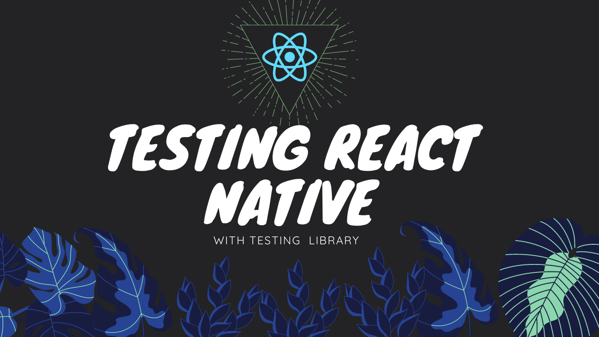

# Testing tutorial

This repository is used in a youtube tutorial I've made about testing so, if you want to learn how to test
a react native application you should definitevely check it out

(clicking the image will redirect you to the youtube video)

[](https://youtu.be/vXrTXC5KiCU)

All that you have to do in order to run this app is install its dependencie and then run it

## installing the dependencies

You can do it using yarn or npm

- using yarn:

```
yarn
```

- usign npm:

```
npm i
```

